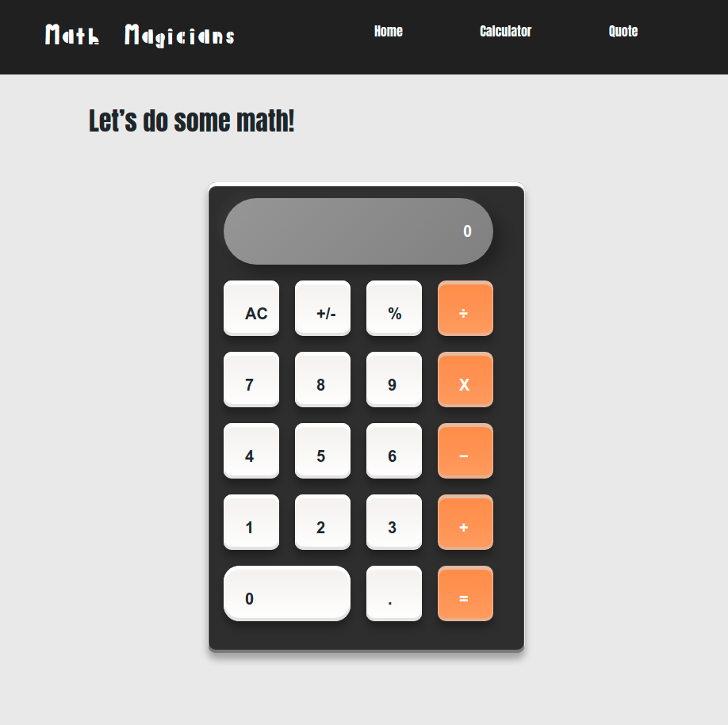

# React Calculator

> This project is part of Microverse React Module with the aim of building a Calculator in React 


Additional description about the project and its features.

## Built With

- React,
- React-DOM,
- [create-react-app](https://github.com/facebook/create-react-app)
- npm,
- CSS,
- ES6

## Live Demo

[Live Demo Link](https://react-project-calculator.herokuapp.com/)



## Getting Started

In order to run locally this project type the following commands over the terminal in Linux or Mac or the Windows cmd console:

```s
$ git clone git@github.com:RailonA/React-Project-Calculator.git
$ cd React-Project-Calculator
$ npm install
$ npm start

```

Open `http://localhost:3000` to view running project in the browser.

> Run the unit tests with
```s
$ npm run test
```

## Author

👤 **Railon Acosta**

- GitHub: [@railonA](https://github.com/RailonA)
- Linkedin: [@railonAcosta](https://www.linkedin.com/in/railon-acosta-81265180/)
- Twitter: [@railonAcosta](https://twitter.com/RailonAcosta)


## 🤝 Contributing

Contributions, issues, and feature requests are welcome!

Feel free to check the [issues page](https://github.com/RailonA/React-Project-Calculator/issues).

## Show your support

Give a ⭐️ if you like this project!

## 📝 License

This project is [MIT](LICENSE) licensed.